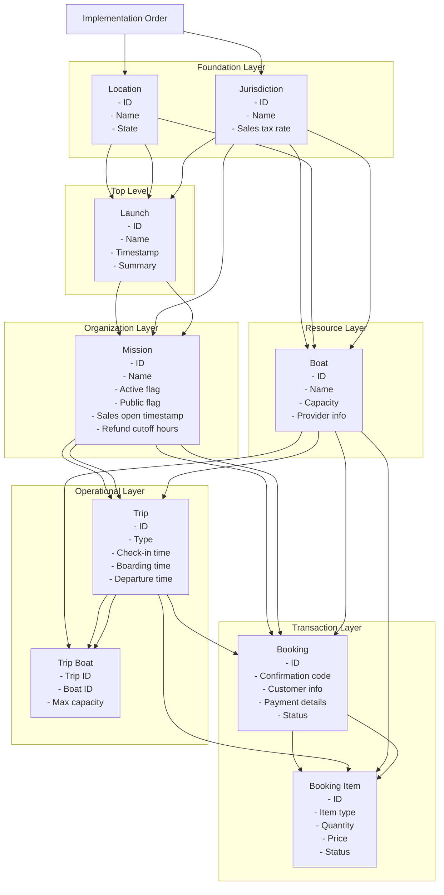

## Data hierarchy and entity relationships

```mermaid
graph TD
    %% Layer definitions with subgraphs
    subgraph Foundation["Foundation Layer"]
        Location["Location<br/>- ID<br/>- Name<br/>- State"]
        Jurisdiction["Jurisdiction<br/>- ID<br/>- Name<br/>- Sales tax rate"]
    end

    subgraph TopLevel["Top Level"]
        Launch["Launch<br/>- ID<br/>- Name<br/>- Timestamp<br/>- Summary"]
    end

    subgraph Organization["Organization Layer"]
        Mission["Mission<br/>- ID<br/>- Name<br/>- Active flag<br/>- Public flag<br/>- Sales open timestamp<br/>- Refund cutoff hours"]
    end

    subgraph Resources["Resource Layer"]
        Boat["Boat<br/>- ID<br/>- Name<br/>- Capacity<br/>- Provider info"]
    end

    subgraph Operations["Operational Layer"]
        Trip["Trip<br/>- ID<br/>- Type<br/>- Check-in time<br/>- Boarding time<br/>- Departure time"]
        TripBoat["Trip Boat<br/>- Trip ID<br/>- Boat ID<br/>- Max capacity"]
    end

    subgraph Transactions["Transaction Layer"]
        Booking["Booking<br/>- ID<br/>- Confirmation code<br/>- Customer info<br/>- Payment details<br/>- Status"]
        BookingItem["Booking Item<br/>- ID<br/>- Item type<br/>- Quantity<br/>- Price<br/>- Status"]
    end

    %% Relationships
    Location --> Launch
    Jurisdiction --> Boat
    Launch --> Mission
    Jurisdiction --> Mission
    Mission --> Trip
    Boat --> TripBoat
    Trip --> TripBoat
    Mission --> Booking
    Booking --> BookingItem
    Trip --> BookingItem
    Boat --> BookingItem

    %% Dependency flow (implementation order)
    classDef implementation fill:#f9f,stroke:#333,stroke-width:2px;
    class Implementation implementation;

    Implementation["Implementation Order"] --> Location & Jurisdiction
    Location & Jurisdiction --> Launch
    Launch --> Mission
    Location & Jurisdiction --> Boat
    Mission & Boat --> Trip
    Trip --> TripBoat
    Mission & Trip & Boat --> Booking
    Booking --> BookingItem
```
