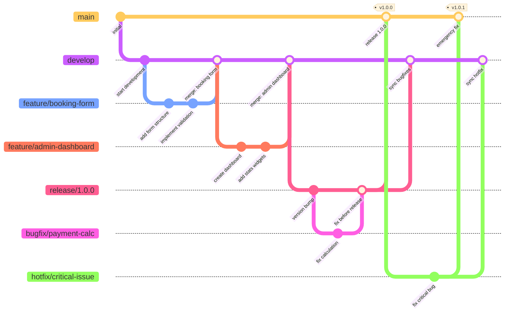

# Deployment Strategy

This document describes the deployment strategy for the Quartermaster project using FastAPI, Docker Compose, Uvicorn, and Traefik, based on the FastAPI Full-Stack Template.

## Services Overview

1. **quartermaster-backend**: FastAPI backend code
2. **quartermaster-frontend**: Astro/Svelte frontend (future phase)
3. **postgres**: PostgreSQL database
4. **traefik**: Reverse proxy and HTTPS

## Deployment Steps

- Use Docker Compose for local development and production deployments.
- To start all services:
  ```bash
  docker compose up --build
  ```
- To stop services:
  ```bash
  docker compose down
  ```
- Environment variables are managed via `.env` files for each service.

## Process Management

- Uvicorn is used as the ASGI server for FastAPI.
- Traefik handles HTTPS and reverse proxying.
- No PM2 or Node.js process manager is required.

## Database Migrations

- Use Alembic for database migrations:
  ```bash
  alembic upgrade head
  ```

## Monitoring and Backups

- Use Sentry for error monitoring.
- Use `pg_dump` for database backups.

## Additional Notes

- For more details, see the [FastAPI Full-Stack Template deployment docs](https://github.com/fastapi/full-stack-fastapi-template).

# Quartermaster Deployment Plan

## Overview

This document outlines the deployment strategy for the Quartermaster project, including repository structure, Git workflow, deployment pipeline, and development setup. The plan is designed to support a structured development process while maintaining flexibility for the team.

## Repository Structure

### Main Repositories

The project will be divided into three main repositories:

1. **quartermaster-backend**: AdonisJS backend code

   - API endpoints
   - Database interactions
   - Business logic

2. **quartermaster-frontend**: Astro + Svelte frontend code

   - Booking interface
   - Admin dashboard
   - Public-facing components

3. **quartermaster-docs**: Project documentation and planning materials
   - Concept documents
   - Stage plans
   - Meeting notes
   - Design assets

## Git Workflow

The project will follow a modified GitFlow workflow to manage development, testing, and releases.

### Branch Strategy



#### Main Branches

- `main` - Production-ready code
  - Always in a deployable state
  - Direct commits prohibited; only accessible via merges from release branches or hotfixes
  - Each merge to main represents a production release
- `develop` - Integration branch for features
  - Primary development branch
  - Contains all completed features for the next release
  - May not always be stable

#### Supporting Branches

- `feature/[feature-name]` - Individual feature branches
  - Created from: `develop`
  - Merge back to: `develop`
  - Naming convention: `feature/booking-form`, `feature/admin-dashboard`, `feature/csv-export`
- `bugfix/[bug-description]` - Bug fix branches
  - Created from: `develop` (for non-critical fixes) or `release/*` (for pre-release fixes)
  - Merge back to: original branch (`develop` or `release/*`)
  - Naming convention: `bugfix/payment-calculation`, `bugfix/email-template`
- `release/[version]` - Release preparation branches
  - Created from: `develop`
  - Merge back to: `main` AND `develop`
  - Naming convention: `release/1.0.0`, `release/1.1.0`
- `hotfix/[description]` - Emergency production fixes
  - Created from: `main`
  - Merge back to: `main` AND `develop`
  - Naming convention: `hotfix/critical-payment-issue`, `hotfix/security-vulnerability`

### Development Flow

1. **Feature Development**

   - Developer creates a feature branch from `develop`:
     ```
     git checkout develop
     git pull
     git checkout -b feature/booking-form
     ```
   - Developer works on the feature independently
   - Regular commits with descriptive messages
   - Pushes branch to GitHub for visibility:
     ```
     git push -u origin feature/booking-form
     ```

2. **Code Review and Integration**

   - When feature is complete, developer opens a Pull Request to `develop`
   - PR requires at least one approval from another team member
   - Automated tests must pass before merging
   - Once approved, feature is merged into `develop`

3. **Release Preparation**

   - When `develop` contains enough features for a release, create a release branch:
     ```
     git checkout develop
     git pull
     git checkout -b release/1.0.0
     ```
   - Version numbers, documentation, and release notes are updated
   - Only bugfixes are committed directly to the release branch
   - QA testing is performed against this branch

4. **Release Finalization**

   - After testing and stabilization, release branch is merged to `main`:
     ```
     git checkout main
     git pull
     git merge --no-ff release/1.0.0
     git tag -a v1.0.0 -m "Version 1.0.0"
     git push origin main --tags
     ```
   - Also merge back to `develop` to capture any bugfixes:
     ```
     git checkout develop
     git merge --no-ff release/1.0.0
     git push origin develop
     ```

5. **Hotfix Process** (for critical production issues)
   - Create hotfix branch from `main`:
     ```
     git checkout main
     git pull
     git checkout -b hotfix/critical-issue
     ```
   - Fix the issue and test thoroughly
   - Merge to both `main` and `develop`:

     ```
     git checkout main
     git merge --no-ff hotfix/critical-issue
     git tag -a v1.0.1 -m "Hotfix 1.0.1"
     git push origin main --tags

     git checkout develop
     git merge --no-ff hotfix/critical-issue
     git push origin develop
     ```

## Deployment Pipeline

### Environments

The project will utilize three environments:

1. **Development Environment**

   - Purpose: Feature integration and internal testing
   - Source: `develop` branch
   - URL: `dev.star-fleet.tours`
   - Deployment: Automatic on successful merge to `develop`
   - Data: Sanitized copy of production data or generated test data

2. **Staging Environment**

   - Purpose: Pre-release testing and client review
   - Source: `release/*` branches
   - URL: `staging.star-fleet.tours`
   - Deployment: Manual trigger or automatic on creation of release branch
   - Data: Recent sanitized copy of production data

3. **Production Environment**
   - Purpose: Live system for end users
   - Source: `main` branch
   - URL: `star-fleet.tours`
   - Deployment: Manual trigger after approval
   - Data: Live user data with regular backups

### Setup

1. Set up SSH keys between GitHub and VPS:

   - Generate SSH key pair on CI server or deployment machine
   - Add public key to VPS authorized_keys
   - Add private key to GitHub repository secrets

2. Configure environment-specific settings:
   - Create separate `.env` files for each environment
   - Store sensitive information in GitHub secrets
   - Use different database credentials for each environment

### Deployment Flow

#### Continuous Integration

For all branches:

1. Code pushed to GitHub
2. GitHub Actions runs:
   - Linting (ESLint, Prettier)
   - Unit tests
   - Build verification
   - Dependency security scanning

#### Development Deployment

1. PR merged to `develop`
2. GitHub Actions workflow:
   - Runs tests
   - Builds application
   - Deploys to development server
   - Sends notification to team

#### Staging Deployment

1. Release branch created
2. GitHub Actions workflow:
   - Runs tests
   - Builds application for production
   - Deploys to staging server
   - Generates release notes
   - Notifies team for testing

#### Production Deployment

1. Release branch merged to `main`
2. GitHub Actions workflow:
   - Runs final tests
   - Builds application for production
   - Waits for manual approval
   - Deploys to production server
   - Tags release in GitHub
   - Sends deployment notification

## Local Development Setup

### Docker Compose Environment

For consistent development environments across the team, the project will use Docker Compose:

1. **Configuration**:
   Create a `docker-compose.yml` file in each repository with services for:

   - PostgreSQL database
   - Backend service (AdonisJS)
   - Frontend service (Astro + Svelte)
   - Redis (for caching, if needed)

2. **Setup Commands**:

   ```bash
   # Initial setup
   git clone https://github.com/star-fleet/quartermaster-backend.git
   cd quartermaster-backend
   cp .env.example .env
   docker-compose up -d

   # Running migrations
   docker-compose exec backend node ace migration:run

   # Seeding database
   docker-compose exec backend node ace db:seed
   ```

3. **Environment Configuration**:
   - Create comprehensive `.env.example` files
   - Document all environment variables in README
   - Include validation for required variables in application startup

### Development Workflow

1. Developers clone repositories and set up local environment
2. Create feature branch from latest `develop`
3. Run application locally using Docker Compose
4. Implement feature with regular commits
5. Run tests locally before pushing
6. Create PR for code review
7. Address review feedback
8. Merge to `develop` when approved

## Database Management

### Migration Strategy

- All schema changes tracked through migrations
- Migrations must be backward compatible when possible
- Separate migration files for each significant change
- Migration naming convention: `YYYYMMDD_HHMMSS_description.ts`

### Seed Data

- Development seed data for quick setup
- Test seed data for automated testing
- Production seed data for initial deployment (if applicable)

### Backup Strategy

- Development: Automatic backup before migrations
- Staging: Daily backups
- Production:
  - Quarterly backups for MVP phase
  - Monthly backup verification tests
  - Option for manual backups before major changes
  - Simple backup script to export database to SQL files

## Monitoring and Maintenance

### Application Monitoring

- Use Sentry for error tracking
- Set up uptime monitoring
- Configure performance monitoring
- Create alerting for critical issues

### Regular Maintenance

- Weekly dependency updates (non-breaking)
- Monthly security patch application
- Quarterly dependency major version evaluation
- Security scanning after significant changes
